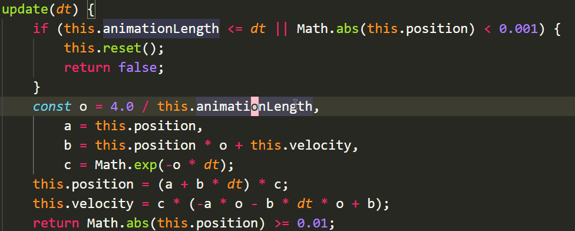
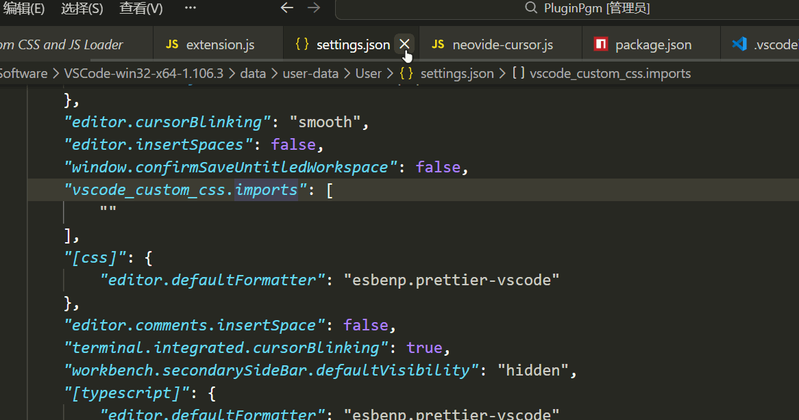
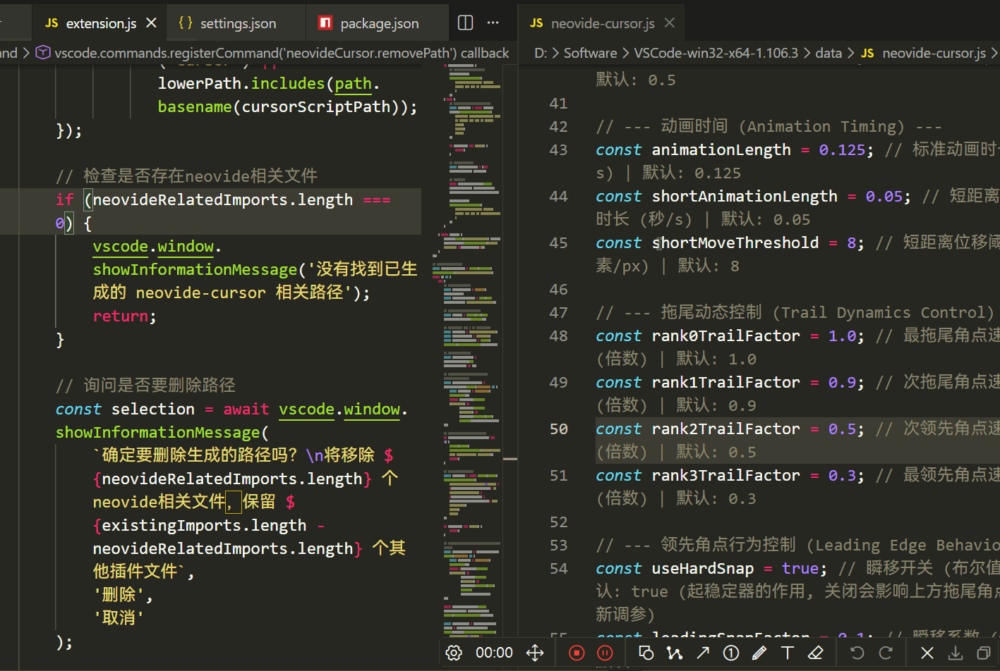

# 🌟 Neovide Cursor

类 Neovide 光标动画插件
Neovide-like Cursor Animation Plugin

## ✨ 特性 (Features)
---
基础动画 | Basic Animation: 


多光标 | Multi-Cursor: 


跨文件 | Cross-File: 


分屏 | Split-Screen


## 📢 重要说明 (Important Notices)
---
- 此插件会带来较为严重的**性能负担**与**电量消耗**，请酌情使用，不建议在您的设备**未连接电源**时开启
- This plugin may cause significant **performance burden** and **power consumption**. Please use it discretionally; it is not recommended to enable it when your device is **NOT** connected to a power source.

- 此插件需要配合 [Custom CSS and JS Loader](https://marketplace.visualstudio.com/items?itemName=be5invis.vscode-custom-css) 插件使用
- This plugin requires the [Custom CSS and JS Loader](https://marketplace.visualstudio.com/items?itemName=be5invis.vscode-custom-css) plugin to function properly.

- 插件目前并不完善，可能会出现意外Bug (如闪烁、不规则形变等)
- The plugin is not yet fully polished and may have unexpected bugs (such as flickering, irregular deformation, etc.).

## 🛠️ 安装步骤 (Installation Steps)
---
### 方法一：通过 VSCode 市场安装 (推荐) | Method 1: Install via VSCode Marketplace (Recommended)

1. 在 VSCode 中打开**扩展**面板 (`Ctrl+Shift+X`) | Open the **Extensions** panel in VSCode (`Ctrl+Shift+X`)
2. 搜索 "" "Neovide Cursor" | Search for "Neovide Cursor"
3. 点击 "安装" | Click "Install"

### 方法二：手动安装 | Method 2: Manual Installation

1. 下载 `.vsix` 文件 | Download `.vsix` file
2. 在 VSCode 中打开**命令**面板 (`Ctrl+Shift+P` 或 `F1`) | Open the **Command** Palette in VS Code (`Ctrl+Shift+P` or `F1`)
3. 输入命令 (Type) "`Extensions: Install from VSIX...`"
4. 选择下载的 `.vsix` 文件 | Select the downloaded `.vsix` file

## 🤔 使用方法 (How to Use)
---
⚠️ 前置条件：已安装本插件和 **Custom CSS and JS Loader** |  ⚠️ Prerequisite: This plugin and **Custom CSS and JS Loader** have been installed

1. 输入命令 "`Neovide Cursor: Generate Path`" 生成文件引入路径 | Type the command `Neovide Cursor: Generate Path` to generate the file import path
 2. (可选) 在设置文件中添加如下配置以覆盖主题光标色: | (Optional) Add the following configuration in the settings file to override the theme cursor color:

```JSON
"workbench.colorCustomizations": {
	"editorCursor.foreground": "#FFC0CB",
},
```

3. 输入命令 "`Reload Custom CSS and JS`" 重新载入 | Type the command `Reload Custom CSS and JS` to reload the configuration
4. 现在你可以看到效果了 | Now you can see the effect

## ⚙️ 配置选项 (Configurations)
---
1. 输入命令 "`Neovide Cursor: Open User Configurations`" 打开插件文件 | Type the command "`Neovide Cursor: Open User Configurations`" to open the user configuration file
2. 根据文件注释自行设置 | Set the configurations as needed according to the file comments

⚠️ 注意：修改文件的其他部分可能会导致无法预料的问题 | ⚠️ Note: Modifying the other parts of the file may cause unexpected issues.

## 🏎️ 性能优化建议 (Performance Optimization Tips)
---
如果你遇到性能问题，可以尝试: | If you encounter performance issues, try the following:

1. 增大 `cursorUpdatePollingRate` 的值 (降低扫描频率) | Increase `cursorUpdatePollingRate` (reduce the polling frequency)
2. 关闭 `useShadow` (禁用辉光效果) | Disable `useShadow` (turn off the glow effect)

## ❓ 常见问题 (FAQ)
---
### Q: 安装后没有效果?

A: 请确保：

1. 已安装 Custom CSS and JS Loader
2. 在 settings.json 中正确配置了脚本路径 (执行了 "``Neovide Cursor: Generate Path``" 命令)
3. 执行了 "`Enable Custom CSS and JS`" 和 "`Reload Custom CSS and JS`" 命令
4. 完全重启了 VSCode

### Q: Why isn't it working after installation?

A: Please ensure:

1. The Custom CSS and JS Loader plugin is installed
2. The script path is correctly configured in `settings.json` (executed the "`Neovide Cursor: Generate Path`" command)
3. You have executed the "`Enable Custom CSS and JS`" and "`Reload Custom CSS and JS`" commands
4. VSCode has been restarted completely

### Q: VSCode 提示 "已损坏" ?

A: 这是因为 Custom CSS and JS Loader 修改了 VSCode 的文件。这是正常现象，不会影响使用。如果想关闭提示，可以：

- 点击 "不再提示"
- 阅读 Custom CSS and JS Loader 文档寻求帮助

### Q: Why does VSCode show a "corrupted" warning?

A: This is because Custom CSS and JS Loader modifies VSCode's internal files. This is normal behavior and won't affect usage. To dismiss the warning:

- Click "Don't show again"
- Refer to the Custom CSS and JS Loader documentation for assistance

### Q: 🗑️ 如何完全卸载?

A: 

1. 执行 "`Remove Generated Path`" 命令
2. 执行 "`Reload Custom CSS and JS`" 命令
3. 重启 VSCode
4. 卸载 Neovide Cursor 插件

### Q: 🗑️ How to completely uninstall it?

A:

1. Run the "`Remove Generated Path`" command
2. Run the "`Reload Custom CSS and JS`" command
3. Restart VSCode
4. Uninstall the Neovide Cursor plugin

## 📃 许可证 (License)
---


## 🤝 鸣谢 (Credits)
---
-  [Neovide](https://github.com/neovide/neovide) Editor
- Juejin developer @LengineerC [我写了一个VSCode的仿Neovide光标动画](https://juejin.cn/post/7578917474659352627)
- Also the project by @LengineerC [Neovide Cursor Effect for VS Code 🚀](https://github.com/LengineerC/vscode-neovide-cursor/tree/main)
- [QuarkPixel](https://github.com/QuarkPixel/QuarkPixel)'s technical support and assistance
- This video: [I made neovide alike cursor effect on vscode](https://www.reddit.com/r/vscode/comments/11e66xh/i_made_neovide_alike_cursor_effect_on_vscode/)
